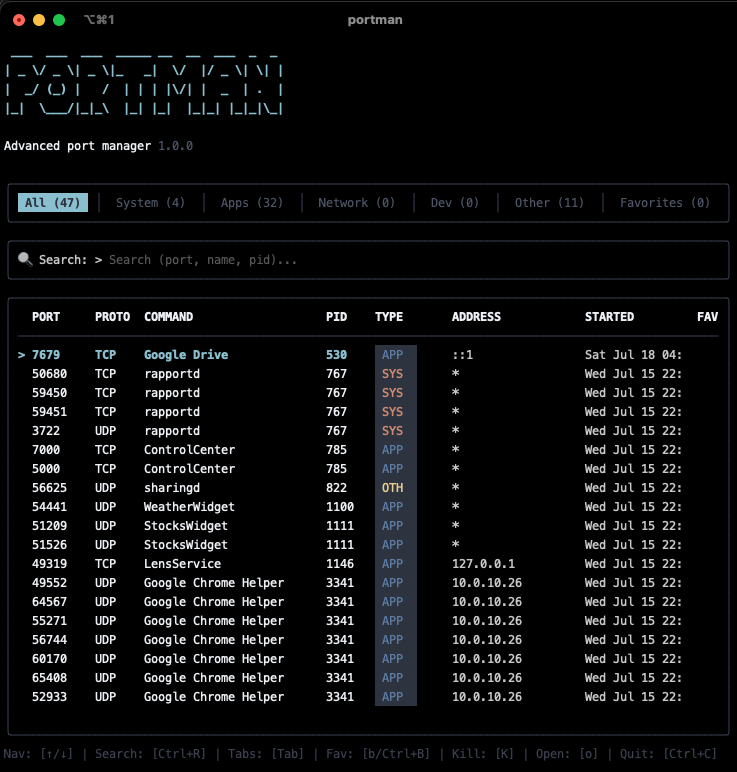

# Portman 🚀

**Postman manages your requests, Portman manages your ports.**

Portman is an advanced, terminal-based User Interface (TUI) for **macOS** and **Linux**, built with Go and Bubble Tea. It provides a robust, fast, and visual way to manage active processes and network ports.



## Features

- [x] **Process & Port Tracking**: Instantly view all open ports and their associated processes.
- [x] **Categorization**: Automatically categorizes ports into System, Apps, Network, Dev, and Other.
- [x] **Favorites Management**: Save important processes (e.g., `docker`, `postgres`) to a favorites list persistently stored in `~/.config/portman/config.json`.
- [x] **Process Killing**: Kill rogue or stuck processes directly from the UI.
- [x] **Browser Integration**: Open local HTTP services directly in your default browser.
- [ ] **Firewall Integration**: Integrated rules management to block specific ports effortlessly (uses `pfctl` on macOS, `iptables` on Linux).

## Installation

### The Easy Way (macOS & Linux)

You can install Portman directly using our universal installation script:

```bash
curl -sSL https://raw.githubusercontent.com/thejavator/portman/main/install.sh | bash
```

### macOS (Homebrew)

```bash
brew tap thejavator/portman https://github.com/thejavator/portman
brew install portman
```

### Linux (Debian/Ubuntu)

Download the `.deb` package from the [Releases page](https://github.com/thejavator/portman/releases) and install it:

```bash
sudo dpkg -i portman_*_linux_amd64.deb
```

### Linux (CentOS/Fedora)

Download the `.rpm` package from the [Releases page](https://github.com/thejavator/portman/releases) and install it:

```bash
sudo rpm -i portman_*_linux_amd64.rpm
```

### From Source

Ensure you have Go 1.24+ installed on your machine.

```bash
git clone https://github.com/thejavator/portman.git
cd portman
go build -o portman .
```

## Usage

Start the interactive UI:
```bash
sudo ./portman
```

Check the version:
```bash
./portman --version
```

### Why `sudo`?
Portman relies on system-level network and process scanning APIs.
- Reading detailed information about processes owned by other users (or the system) requires root privileges.
- Interacting with the firewall (`pfctl` on macOS, `iptables` on Linux) strictly requires root privileges.

If you run Portman without `sudo`, it will still work, but you won't be able to see root processes or manage the firewall.

## Keyboard Shortcuts

| Key | Action |
| --- | --- |
| `↑` / `↓` | Navigate the list of ports |
| `Tab` | Switch categories |
| `Ctrl+R` | Focus the search bar |
| `Esc` | Unfocus the search bar |
| `b` / `Ctrl+B` | Toggle favorite for the selected process |
| `k` | Kill the selected process |
| `o` | Open the port in the default web browser |
| `Ctrl+C` / `q` | Quit Portman |

## Configuration

Portman creates a configuration file located at `~/.config/portman/config.json` to store your favorite processes.

## License

This project is licensed under the MIT License - see the [LICENSE](LICENSE) file for details.
